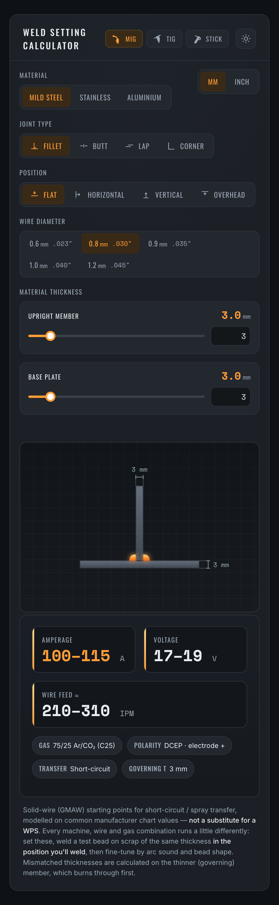
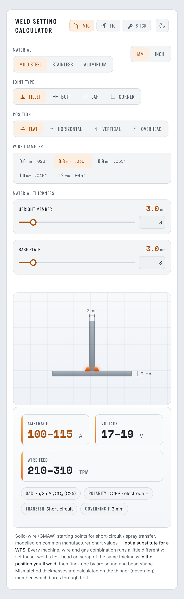

# Weld Setting Calculator

A fast, single-screen tool that gives you **starting** welding parameters from a
few inputs — pick your process, material, joint, position, consumable and plate
thickness, and get an amperage range (plus voltage / wire-feed, polarity,
shielding gas or electrode, as the process calls for) alongside a **live
cross-section of the joint** that updates as you type.

It covers **MIG, TIG and Stick** across mild steel, stainless and aluminium, in
metric or imperial, with plain-language advisories when a choice is worth a
second look. The numbers are starting points to dial in on scrap — **not a
substitute for a WPS**.

<table>
  <tr>
    <td align="center">
      <br>
      <sub>Dark mode</sub>
    </td>
    <td align="center">
      <br>
      <sub>Light mode</sub>
    </td>
  </tr>
</table>

## Features

- **Three processes** — MIG (GMAW), TIG (GTAW) and Stick (SMAW), each with a
  process-specific engine and results.
- **Live joint illustration** — a 2D cross-section that reflects the joint,
  position and each member's thickness in real time.
- **Materials & units** — mild steel, stainless and aluminium; switch between
  metric and imperial without losing your values.
- **Sensible defaults & advisories** — the app opens ready to weld, and flags
  things like burn-through risk, multi-pass thickness or out-of-position amps.
- **Light / dark themes** — follows your system preference, remembers your
  choice, and is built to WCAG AA.

## Development

```bash
npm run dev       # start the Vite dev server with HMR
npm run build     # type-check (tsc -b) then produce a production build
npm run preview   # serve the production build locally
npm run lint      # run Oxlint
```

## Tech

Vite 8 · React 19 (React Compiler) · TypeScript · Oxlint. Pure, framework-agnostic
recommendation engines live in `src/lib/`; shared state is a small React context
(`useWeldSettings`); the UI is composed from focused components in
`src/components/`.
